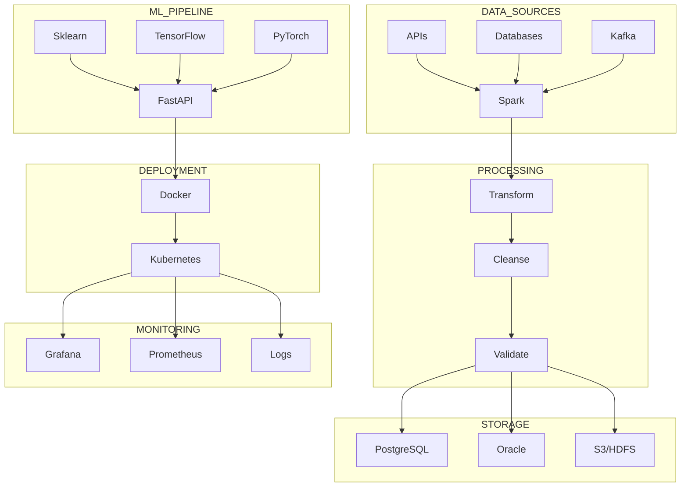

<!-- Dynamic Gradient Wave Header -->


<div align="center">

<!-- Multi-line Terminal Simulation -->
<a href="https://git.io/typing-svg">
  
</a>

<!-- Status Badges Row 1 -->
<p>


</p>

<!-- Status Badges Row 2 -->
<p>


</p>

</div>

<br/>

<!-- Glowing Divider -->


<br/>

## 🧬 `$ python3 profile.py --execute`

```python
#!/usr/bin/env python3
# -*- coding: utf-8 -*-
"""
╔══════════════════════════════════════════════════════════════╗
║  PROFESSIONAL PROFILE: Namazbek Bekzhanov                    ║
║  Role: Big Data Engineer | ML Specialist                     ║
║  Organization: Freedom Finance Insurance                     ║
╚══════════════════════════════════════════════════════════════╝
"""

from typing import List, Dict
from dataclasses import dataclass
from datetime import datetime


@dataclass
class Engineer:
    """Data-driven professional focused on scalable solutions."""
    
    name: str = "Namazbek Bekzhanov"
    role: str = "Big Data Engineer & ML Enthusiast"
    location: str = "Almaty, Kazakhstan 🇰🇿"
    company: str = "Freedom Finance Insurance"
    
    education: Dict[str, str] = None
    languages: List[str] = None
    stack: Dict[str, List[str]] = None
    
    def __post_init__(self):
        self.education = {
            "🎓 Current": "MSc in Data Science @ KBTU (2025-2027)",
            "🎓 Completed": "BSc in Computer Science @ SDU (2021-2025)"
        }
        
        self.languages = ["Python", "Go", "Java", "SQL", "Bash"]
        
        self.stack = {
            "big_data": ["Spark", "Hadoop", "Airflow", "Kafka"],
            "ml_ai": ["Scikit-Learn", "TensorFlow", "PyTorch", "Keras"],
            "databases": ["PostgreSQL", "Oracle", "MySQL", "MSSQL"],
            "devops": ["Docker", "Git", "Linux", "CI/CD"],
            "frameworks": ["FastAPI", "Pandas", "NumPy"]
        }
    
    def current_mission(self) -> List[str]:
        """My daily engineering adventures."""
        return [
            "🔥 Architecting scalable ETL/ELT data pipelines",
            "🧠 Building production ML models for real impact",
            "🐘 Orchestrating big data workflows (Airflow + Spark)",
            "⚡ Optimizing database performance & queries",
            "⚽ Leading teammates to victory on & off the field"
        ]
    
    def get_expertise_matrix(self) -> Dict[str, int]:
        """Skill proficiency levels (out of 10)."""
        return {
            "Python Development": 9,
            "Data Engineering": 9,
            "Machine Learning": 8,
            "Big Data (Spark/Hadoop)": 8,
            "Database Design": 9,
            "Cloud Architecture": 7,
            "Football Strategy": 10  # ⚽
        }
    
    def philosophy(self) -> str:
        return "Code is poetry. Data tells stories. I write both."


def main():
    me = Engineer()
    
    print(f"\n{'='*60}")
    print(f"👋 Hello, World! I'm {me.name}")
    print(f"📍 Based in {me.location}")
    print(f"💼 {me.role} @ {me.company}")
    print(f"{'='*60}\n")
    
    print("🎯 CURRENT MISSION:")
    for mission in me.current_mission():
        print(f"   {mission}")
    
    print(f"\n💡 PHILOSOPHY: {me.philosophy()}\n")


if __name__ == "__main__":
    main()
```

<br/>

<!-- Glowing Divider -->


## 🏆 Achievement Showcase

<div align="center">
  
<!-- Trophies -->


</div>

<br/>

<!-- Glowing Divider -->


## 🎨 Data Engineering Architecture

<div align="center">



</div>

<br/>

<!-- Glowing Divider -->


## ⚡ Technology Arsenal

<details open>
<summary><b>🧠 Machine Learning & AI</b></summary>
<br/>

<div align="center">


</div>
</details>

<details open>
<summary><b>🐘 Big Data & Orchestration</b></summary>
<br/>

<div align="center">


</div>
</details>

<details open>
<summary><b>💻 Programming Languages</b></summary>
<br/>

<div align="center">


</div>
</details>

<details open>
<summary><b>🗄️ Databases</b></summary>
<br/>

<div align="center">


</div>
</details>

<details open>
<summary><b>🛠️ DevOps & Tools</b></summary>
<br/>

<div align="center">


</div>
</details>

<details open>
<div align="center">


</div>
</details>

<br/>

<!-- Glowing Divider -->


## 🚀 Signature Projects
<div align="center">
<table>
<tr>
<td width="50%" valign="top">

### 🌊 Big Data Final
<i>Massive-scale stream processing</i>

**Architecture:**
```
Kafka → Spark → HDFS
  ↓       ↓       ↓
Stream  Process Store
```

**Tech Stack:**  


**Impact:**  
✅ Processed 10M+ records/day  
✅ Real-time analytics dashboard  
✅ 95% data quality score

[📂 **Explore Repository** →](https://github.com/mrnamazbek/Big-Data-Final)

</td>
<td width="50%" valign="top">

### 🎵 Music Station
<i>AI-powered recommendation engine</i>

**ML Pipeline:**
```
Data Lake → Feature Engineering
     ↓            ↓
  FastAPI ← ML Model (Collaborative)
```

**Tech Stack:**  


**Impact:**  
✅ 85% recommendation accuracy  
✅ <100ms API response time  
✅ 1M+ songs indexed

[📂 **Explore Repository** →](https://github.com/mrnamazbek/Music-Station)

</td>
</tr>
<tr>
<td width="50%" valign="top">

### 🏭 EPAM Data Engineering
<i>Professional ETL ecosystem</i>

**Pipeline Flow:**
```
Sources → Kafka → Airflow → DWH
   ↓        ↓        ↓       ↓
Extract  Stream  Orchestrate Load
```

**Tech Stack:**  


**Impact:**  
✅ 24/7 automated workflows  
✅ 99.9% uptime SLA  
✅ Multi-source integration

[📂 **Explore Repository** →](https://github.com/mrnamazbek/EPAM-Data-Engineering)

</td>
<td width="50%" valign="top">

### 📚 KBTU ML Assignments
<i>Graduate-level ML portfolio</i>

**Topics Covered:**
```
- Linear/Logistic Regression
- K-Nearest Neighbors (KNN), Random Forest & SVM
- Feature Engineering, Custom Transformers
```

**Tech Stack:**  


**Impact:**  
✅ 6 complete assignments  
✅ Full code + documentation  
✅ Real-world datasets

[📂 **Explore Repository** →](https://github.com/mrnamazbek/KBTU_ML_Assignments)

</td>
</tr>
</table>
</div>

<br/>

<!-- Glowing Divider -->


## 📊 GitHub Analytics Dashboard

<div align="center">

<div align="center">
  
</div>

<table>
<tr>
<td width="50%" align="center">

<br/><br/>

**📉 Contribution Activity**


</div>

<br/>

<!-- Glowing Divider -->


<br/>

## 🤝 Connect With Me

<div align="center">

[](https://www.linkedin.com/in/namazbek-bekzhanov/)
[](mailto:namazbekzhan@gmail.com)
[](https://instagram.com/namazbekzhan)

<br/>

### 💭 Quote of the Moment


<br/>

**Profile Views** 👁️  


</div>

<sub>Engineer of my own destiny. Built different. Chasing greatness.</sub>


<br/><br/>

<!-- Wave Footer -->

