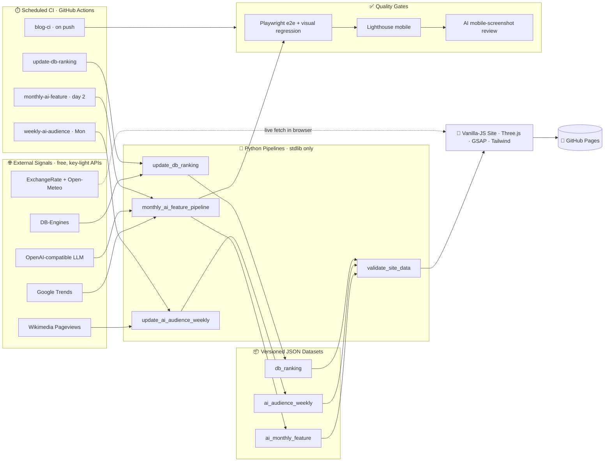

<!-- ═══════════════════════════════════════════════════════════════════════
     NAMAZBEK BEKZHANOV · github.com/mrnamazbek
     This repository is BOTH my GitHub profile README *and* the source of my
     live, self-updating personal website → https://mrnamazbek.github.io/mrnamazbek/
     ═══════════════════════════════════════════════════════════════════════ -->

<!-- Dynamic Gradient Wave Header -->


<div align="center">

<!-- Multi-line Terminal Simulation -->
<a href="https://github.com/mrnamazbek">
  
</a>

<!-- Quick Links (clickable) -->
<p>
<a href="https://mrnamazbek.github.io/mrnamazbek/"></a>
<a href="assets/Namazbek_s_Resume_INT.pdf"></a>
<a href="https://www.linkedin.com/in/namazbek-bekzhanov/"></a>
<a href="mailto:namazbekzhan@gmail.com"></a>
</p>

<!-- Status Badges Row 1 -->
<p>


</p>

<!-- Status Badges Row 2 (concurrent roles) -->
<p>


</p>

</div>

<br/>

<!-- Glowing Divider -->


<br/>

## 🛰️ This Repo Is Alive

> **`mrnamazbek/mrnamazbek` is not a static profile — it's a self-driving website.**
> Scheduled GitHub Actions wake up every week, pull fresh signals from public APIs
> (Google Trends, Wikimedia, DB-Engines, exchange rates, weather), regenerate
> versioned JSON datasets, run an **AI-authored "feature of the month,"** gate
> everything behind **Playwright + Lighthouse**, and redeploy — all with **zero
> manual edits**. The README you're reading and the live site share the same repo.

<div align="center">

[](https://mrnamazbek.github.io/mrnamazbek/)

</div>

<br/>

<!-- Glowing Divider -->


## 🧬 `$ python3 profile.py --execute`

```python
#!/usr/bin/env python3
# -*- coding: utf-8 -*-
"""
╔══════════════════════════════════════════════════════════════════╗
║  PROFESSIONAL PROFILE: Namazbek Bekzhanov                         ║
║  Role: Data Engineer & Backend Developer | SQL Optimizer         ║
║  Now: Middle Data Engineer @ The National Bank of Kazakhstan      ║
╚══════════════════════════════════════════════════════════════════╝
"""

from dataclasses import dataclass, field
from typing import Dict, List


@dataclass
class Engineer:
    """Data-driven engineer focused on scalable, self-updating systems."""

    name: str = "Namazbek Bekzhanov"
    role: str = "Data Engineer & Backend Developer"
    location: str = "Almaty, Kazakhstan 🇰🇿"

    # Several concurrent roles — finance & data at the core
    roles: Dict[str, str] = field(default_factory=lambda: {
        "🏦 Now":      "Middle Data Engineer · National Bank of KZ (Digital Dev Center)",
        "🛡️ Also":     "Data Engineer · Freedom Insurance",
        "🎓 Teaching": "Teaching Assistant · KBTU",
        "🌐 Trainee":  "Data Software Engineering · EPAM Systems",
    })

    education: Dict[str, str] = field(default_factory=lambda: {
        "🎓 MSc": "Data Science @ KBTU (2025–2027)",
        "🎓 BSc": "Computer Science @ SDU (2021–2025)",
    })

    languages: List[str] = field(default_factory=lambda: ["Python", "Go", "Java", "SQL", "Bash"])

    stack: Dict[str, List[str]] = field(default_factory=lambda: {
        "big_data":  ["Spark", "Hadoop", "Airflow", "Kafka"],
        "databases": ["PostgreSQL", "Oracle", "MS SQL Server", "MySQL", "MongoDB", "Redis"],
        "ml_ai":     ["scikit-learn", "PyTorch", "TensorFlow", "pandas", "NumPy"],
        "backend":   ["FastAPI", "REST", "Docker", "Linux", "CI/CD"],
    })

    def current_mission(self) -> List[str]:
        """What I'm shipping these days."""
        return [
            "🏦 Data modeling for secure, fast financial reporting & analytics",
            "🛡️ Hardening data governance, resiliency & cold-data management",
            "🤖 Researching ML fraud detection (Master's thesis)",
            "🛰️ Running this site's self-updating AI + data pipelines",
            "⚽ Captaining the team — on the pitch and in the repo",
        ]

    def philosophy(self) -> str:
        return "Code is poetry. Data tells stories. I automate both."


if __name__ == "__main__":
    me = Engineer()
    print(f"👋 Hi, I'm {me.name} — {me.role}, based in {me.location}")
    for goal in me.current_mission():
        print(f"   {goal}")
    print(f"💡 {me.philosophy()}")
```

<br/>

<!-- Glowing Divider -->


## 🏗️ How This Site Builds & Updates Itself

<div align="center">


```mermaid
flowchart LR
    subgraph EXT["🌐 External Signals · free, key-light APIs"]
        G["Google Trends"]
        LLM["OpenAI-compatible LLM"]
        WM["Wikimedia Pageviews"]
        DBE["DB-Engines"]
        FXW["ExchangeRate + Open-Meteo"]
    end

    subgraph CI["⏱️ Scheduled CI · GitHub Actions"]
        M["monthly-ai-feature · day 2"]
        A["weekly-ai-audience · Mon"]
        R["update-db-ranking"]
        B["blog-ci · on push"]
    end

    subgraph PY["🐍 Python Pipelines · stdlib only"]
        P1["monthly_ai_feature_pipeline"]
        P2["update_ai_audience_weekly"]
        P3["update_db_ranking"]
        V["validate_site_data"]
    end

    subgraph DS["📦 Versioned JSON Datasets"]
        J1["ai_monthly_feature"]
        J2["ai_audience_weekly"]
        J3["db_ranking"]
    end

    subgraph GATE["✅ Quality Gates"]
        PW["Playwright e2e + visual regression"]
        LH["Lighthouse mobile"]
        VR["AI mobile-screenshot review"]
    end

    SITE["🎨 Vanilla-JS Site · Three.js · GSAP · Tailwind"]
    PAGES[("🚀 GitHub Pages")]

    G --> P1
    LLM --> P1
    WM --> P2
    DBE --> P3
    M --> P1
    A --> P2
    R --> P3
    P1 --> J1
    P2 --> J2
    P3 --> J3
    J1 --> V
    J2 --> V
    J3 --> V
    V --> SITE
    FXW -. live fetch in browser .-> SITE
    P1 --> PW --> LH --> VR
    B --> GATE
    SITE --> PAGES
```

</div>

<br/>

<!-- Glowing Divider -->


## 🤖 Self-Driving Automation

> Five Python pipelines (**standard library only — no `requests`, no SDKs**) feed the site,
> orchestrated by **4 GitHub Actions workflows** + a **GitLab CI** cloud-agent push.

| ⚙️ Workflow | ⏰ Schedule | 🔌 Source | 📤 Produces |
|---|---|---|---|
| `monthly-ai-feature` | Day 2 · 04:00 UTC | Google Trends → LLM | `ai_monthly_feature.json` + a fresh Playwright spec, Lighthouse audit & AI mobile review |
| `weekly-ai-audience` | Mondays · 04:30 UTC | Wikimedia Pageviews | `ai_audience_weekly.json` (tech-topic engagement pulse) |
| `update-db-ranking` | Scheduled | DB-Engines ranking | `db_ranking.json` (live database popularity) |
| `blog-ci` | On push | — | Lints + tests all runnable blog demos |
| `monthly_ai_feature_to_cloud_agent` *(GitLab)* | Scheduled | — | POSTs the monthly feature JSON to a cloud agent |

**In the browser, live:** USD→RUB/GBP/EUR exchange rates and Almaty/Shymkent/Astana
weather, fetched client-side and **degrading gracefully to `N/A`** on any API hiccup.

<br/>

<!-- Glowing Divider -->


## 🎮 Interactive Engineering Toys

The site is hand-built in **vanilla JS** — no framework — yet ships a full **Developer Lab**:

<div align="center">
<table>
<tr>
<td width="50%" valign="top">

### 🧪 Developer Lab
- **🐳 Docker Compose Generator** — pick a DB, get a copy/download-ready `compose` file
- **💰 Cloud Cost Estimator** — CPU/RAM/storage × provider × region, with currency toggle
- **🔣 Regex Playground** — test patterns live
- **📡 Live Tech Radar** — adoption signals at a glance

</td>
<td width="50%" valign="top">

### ✨ Visual & Spatial
- **🔀 Data-Pipeline (DAG) Visualizer** — drag, connect & delete source→transform→sink nodes
- **🌐 3D Keyword Globe** — Three.js, up to 150 tech tags, **fully keyboard-accessible**
- **🌊 Custom WebGL shader** background (hand-written GLSL simplex noise)
- **🪐 Anti-gravity particles**, custom cursor & GSAP scroll-triggered motion

</td>
</tr>
</table>
</div>

Plus: 🌗 light/dark theme, an accessible focus-trapped résumé modal, a live **DB-Engines
ranking** table (mobile cards / desktop sticky-header), an **AI feature of the month**,
and a **weekly audience pulse** chart.

<br/>

<!-- Glowing Divider -->


## ⚡ Technology Arsenal

<details open>
<summary><b>🧠 Machine Learning & AI</b></summary>
<br/>
<div align="center">


</div>
</details>

<details open>
<summary><b>🐘 Big Data & Orchestration</b></summary>
<br/>
<div align="center">


</div>
</details>

<details open>
<summary><b>💻 Programming Languages</b></summary>
<br/>
<div align="center">


</div>
</details>

<details open>
<summary><b>🗄️ Databases</b></summary>
<br/>
<div align="center">


</div>
</details>

<details open>
<summary><b>🛠️ DevOps, Backend & Tools</b></summary>
<br/>
<div align="center">


</div>
</details>

<details>
<summary><b>🌐 This Site Is Built With</b></summary>
<br/>
<div align="center">


</div>
</details>

<br/>

<!-- Glowing Divider -->


## 🚀 Signature Projects

<div align="center">
<table>
<tr>
<td width="50%" valign="top">

### 🛡️ Fraud Detection (Master's Thesis)
<i>ML on financial transaction data</i>

**Focus:**
```
Imbalanced data → Features → Model → Eval
```

**Tech Stack:**


**Highlights:**
✅ Graduate research project
✅ Imbalanced-class techniques
✅ Finance-grade evaluation

[📂 **Explore Repository** →](https://github.com/mrnamazbek/fraud-detection-thesis)

</td>
<td width="50%" valign="top">

### 🤖 Gmail + Drive AI Suite
<i>AI inbox & file automation</i>

**Flow:**
```
Apps Script → Gemini → Auto-actions
```

**Tech Stack:**


**Highlights:**
✅ Auto-categorize & clean inbox
✅ Track job applications & deadlines
✅ Daily AI briefings

[📂 **Explore Repository** →](https://github.com/mrnamazbek/gmail-drive-ai-suite)

</td>
</tr>
<tr>
<td width="50%" valign="top">

### 🏭 EPAM Data Engineering
<i>DWH / data-lake patterns</i>

**Pipeline Flow:**
```
Sources → Kafka → Airflow → DWH
```

**Tech Stack:**


**Highlights:**
✅ ETL & ELT workflows
✅ Modern DWH / lake patterns
✅ Dockerized & reproducible

[📂 **Explore Repository** →](https://github.com/mrnamazbek/EPAM-Data-Engineering)

</td>
<td width="50%" valign="top">

### 📚 KBTU ML Assignments
<i>Graduate ML portfolio</i>

**Topics Covered:**
```
Regression · KNN · Random Forest · SVM
Feature Engineering · Custom Transformers
```

**Tech Stack:**


**Highlights:**
✅ Full code + documentation
✅ Real-world datasets
✅ Hands-on with TF & PyTorch

[📂 **Explore Repository** →](https://github.com/mrnamazbek/KBTU_ML_Assignments)

</td>
</tr>
</table>

<sub>…and more — including <a href="https://github.com/mrnamazbek/ultimate_data_engineering_projects">ultimate_data_engineering_projects</a> · <a href="https://github.com/mrnamazbek?tab=repositories">browse all repos →</a></sub>

</div>

<br/>

<!-- Glowing Divider -->


## ✍️ Technical Blog (with runnable demos)

Three deep-dive posts — each paired with a **fully Dockerized, unit + smoke-tested demo**:

| Post | Topic | Runnable Demo |
|---|---|---|
| **A** | [Postgres query optimization](blog/post-a-postgres-query-optimization.md) | [`demos/post-a-postgres/`](blog/demos/post-a-postgres) — Docker + pytest |
| **B** | [ETL & AI feature pipelines](blog/post-b-etl-ai-feature-pipelines.md) | [`demos/post-b-feature-pipeline/`](blog/demos/post-b-feature-pipeline) — Docker + pytest |
| **C** | [Python performance for data pipelines](blog/post-c-python-performance-data-pipelines.md) | [`demos/post-c-python-perf/`](blog/demos/post-c-python-perf) — Docker + pytest |

A monthly **[Trends TL;DR](blog/trends-tldr-2026-02.md)** distills fresh data-engineering sources, and the
[maintainer playbook](blog/CONTENT_MAINTAINERS_README.md) documents the AI-assisted regeneration workflow.

<br/>

<!-- Glowing Divider -->


## 🧪 Quality & Testing

> Shipping a personal site like production: every change is gated.

- **🎭 Playwright** — 5 specs: responsive smoke (320→1440px), **visual regression**, live-signals resilience, monthly-feature render, audience-pulse render
- **🚦 Lighthouse** — automated mobile performance/accessibility audits
- **🐍 pytest** — unit + smoke tests for all 3 blog demos (Docker integration)
- **🔍 `validate_site_data.py`** — schema/sanity checks across the JSON datasets
- **🤳 AI mobile review** — captures a mobile screenshot and asks an LLM to score the UI
- **📋 [QA checklist](qa-checklist.md)** — manual sign-off for modals, overflow, contrast & focus

<br/>

<!-- Glowing Divider -->


## ⚙️ Run It Locally

```bash
# 1 · Clone
git clone https://github.com/mrnamazbek/mrnamazbek.git
cd mrnamazbek

# 2 · Serve the static site — there is NO build step
python -m http.server 4173
#     → open http://127.0.0.1:4173

# 3 · Install test tooling
npm install
npx playwright install --with-deps chromium

# 4 · Run the end-to-end suite
npm run test:e2e        # core specs
npm run test:e2e:all    # everything, incl. visual regression

# 5 · Regenerate the monthly AI feature — offline, no API key needed
npm run feature:monthly:offline

# 6 · Validate the datasets
python scripts/validate_site_data.py
```

<details>
<summary><b>📁 Repository structure</b></summary>

```
mrnamazbek/
├── index.html                 # Single-page site (sections, modals, canvases)
├── assets/
│   ├── logic.js               # Shaders, globe glue, scroll FX, core UI
│   ├── developer-lab.js       # Docker gen · cost estimator · regex · tech radar
│   ├── keywords-globe.js      # Accessible 3D keyword globe (Three.js)
│   ├── ai-monthly-feature.js  # Monthly feature + live FX/weather widget
│   ├── audience-pulse.js      # Weekly audience engagement viz
│   ├── *.json                 # Versioned datasets (auto-updated by CI)
│   └── styles.css · logos/
├── scripts/                   # 5 stdlib-only Python pipelines
├── tests/                     # 5 Playwright specs (e2e + visual regression)
├── blog/                      # 3 posts + Dockerized, tested demos
├── docs/                      # Automation runbooks
├── .github/workflows/         # 4 scheduled GitHub Actions
└── .gitlab-ci.yml             # Cloud-agent push
```

</details>

<br/>

<!-- Glowing Divider -->


## 🏆 Achievement Showcase

<div align="center">


</div>

<br/>

<!-- Glowing Divider -->


## 📊 GitHub Analytics

<div align="center">


<br/>


<br/>


</div>

<br/>

<!-- Glowing Divider -->


## 🤝 Connect With Me

<div align="center">

[](https://mrnamazbek.github.io/mrnamazbek/)
[](https://www.linkedin.com/in/namazbek-bekzhanov/)
[](mailto:namazbekzhan@gmail.com)
[](https://instagram.com/namazbekzhan)

<br/>

### 💭 Quote of the Moment


<br/>


</div>

<sub align="center">Engineer of my own destiny. Built different. Automating greatness. ⚡</sub>

<br/><br/>

<!-- Wave Footer -->

